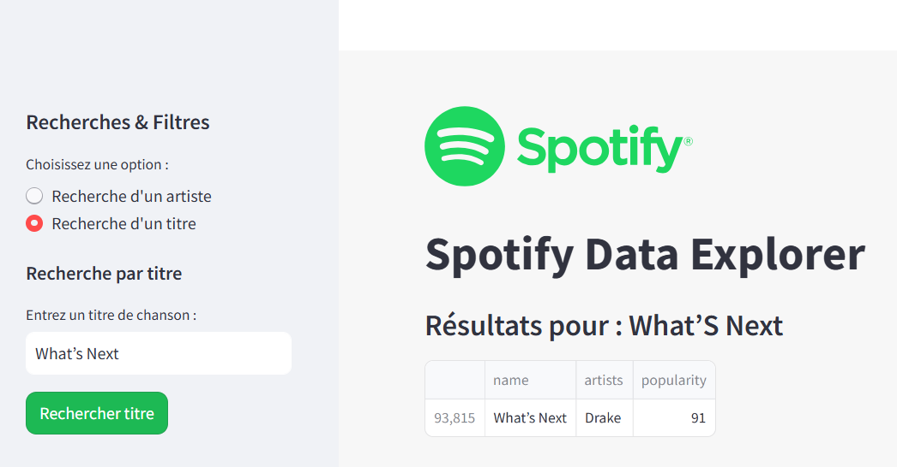

Spotify Data Explorer

Auteur : BAH Saikou

### **1. Introduction & Objectif**

Ce projet propose une exploration approfondie des données Spotify afin de mieux comprendre les tendances musicales et les artistes les plus populaires. L'objectif est de :

- Analyser la popularité des artistes et des chansons.

- Identifier les genres musicaux dominants et les tendances d'écoute.

- Comparer les classements de popularité en fonction des streams et des autres métriques.

- Permettre une exploration interactive via une interface Streamlit.

### **2. Contenu du Projet**

Le projet est structuré comme suit :

- data/ : Contient les fichiers CSV avec les données Spotify.

- Images/ : Captures d'écran de l'application.

- notebooks/ : Un notebook Jupyter pour l'analyse des données.

- Scripts/ : Contient les fichiers Streamlit app1.py et app2.py.

- Sujet/ : Document décrivant les objectifs du projet.

- requirements.txt : Liste des dépendances Python.

- environment.yml : Fichier pour créer un environnement Conda.

- README.md : Ce fichier décrivant le projet.

### **3. Installation & Prérequis**

**Environnement**

- Ce projet utilise Python 3.10 et peut être exécuté dans un environnement Conda.

**Installation des dépendances**

- Créer et activer l’environnement Conda :

conda env create -f environment.yml
conda activate spotify_env

- Installer les bibliothèques Python :

pip install -r requirements.txt

### **4. Exécution des applications Streamlit**

Pour exécuter les applications, utilisez :

# Pour la recherche d'artistes et de titres
streamlit run Scripts/app1.py

# Pour le filtrage par année et genre
streamlit run Scripts/app2.py  

## **5. Exploration des Données & Résultats**

L'analyse des données a permis d'obtenir plusieurs observations intéressantes :

- Disparités entre artistes : La popularité est fortement inégale, avec un petit groupe de superstars dominant le marché, tandis que la majorité des artistes restent peu suivis.

- Tendances des genres musicaux : Le pop domine largement, suivi par le dance pop et le trap latino, confirmant l'essor des musiques hispanophones sur la plateforme.

- Classement des artistes : Ed Sheeran, Ariana Grande et Drake comptent parmi les artistes les plus suivis, tandis que Juice WRLD et Billie Eilish sont les plus présents dans le Top 200.

- Corrélations intéressantes : La popularité des chansons récentes est plus élevée, et l'énergie sonore est fortement corrélée avec la loudness, ce qui montre une tendance vers des morceaux dynamiques.

- Évolution des productions musicales : Une forte croissance de la production musicale est observée à partir des années 1950, avec un pic avant une chute notable dans les années 90 et durant la période Covid-19.

### **6. Fonctionnalités Interactives**

L'application permet :

- La recherche d'un artiste et l'affichage de ses informations (followers, popularité, chansons populaires, lien Wikipédia).

- La recherche d'un titre de chanson et l'affichage des résultats correspondants.

- Le filtrage des chansons par année et genre musical pour analyser l'évolution des tendances.

### **7. Comment Contribuer ?**

Vous pouvez contribuer en :

- Améliorant les filtres de recherche.

- Ajoutant de nouvelles visualisations interactives.

- Intégrant d'autres sources de données musicales pour enrichir l'analyse.

### **8. Conclusion**

Ce projet met en lumière des tendances musicales captivantes et propose un outil interactif pour explorer les données Spotify de manière dynamique.

Les résultats obtenus confirment la concentration de l'industrie musicale autour de quelques artistes dominants, tout en révélant l'impact des nouvelles tendances et de l'évolution du streaming.

### **9. Contact**

Pour toute question ou suggestion, contactez-moi via mon site : saikou-bah.github.io/mon_site_public

